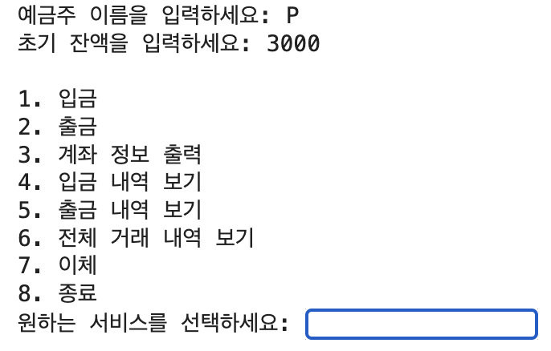
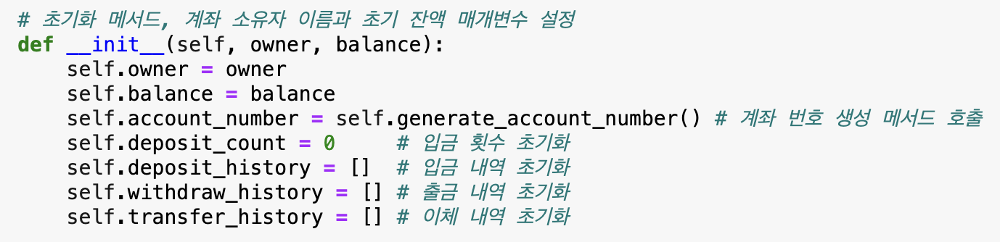
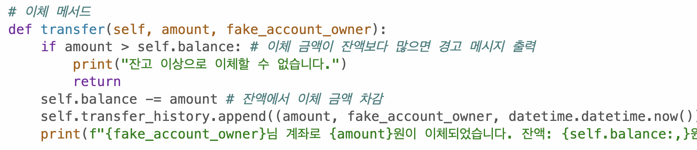
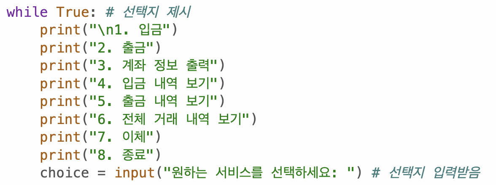
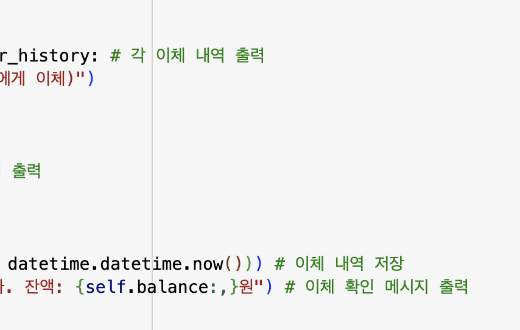

# AIFFEL Data Scientist Campus Code Peer Review Templete

코더 : 서민정

리뷰어 : 박윤희

---

🔑 **PRT(Peer Review Template)**

[O]  **1. 주어진 문제를 해결하는 완성된 코드가 제출되었나요?**
- 주어진 문제를 모두 해결하였으며, 동작 또한 잘 됩니다.
	- 
    
[O]  **2. 전체 코드에서 가장 핵심적이거나 가장 복잡하고 이해하기 어려운 부분에 작성된 
	주석 또는 doc string을 보고 해당 코드가 잘 이해되었나요?**
- 주석이 잘 되어 있어서 이해하기 좋았습니다.
	- 
        
[O]  **3. 에러가 난 부분을 디버깅하여 문제를 “해결한 기록"을 남겼거나 "새로운 시도 
또는 추가 실험"을 수행해봤나요?**
- 이체 기능과 선택지 메뉴를 제시하는 새로운 시도를 하였습니다.
	- 
	- 

        
[O]  **4. 회고를 잘 작성했나요?**
- 오늘 퀘스트에서 회고는 해당 사항 없습니다.

[△]  **5. 코드가 간결하고 효율적인가요?**
- 코드가 간결하게 함수화되어 있습니다.
- PEP8에서 권장하는 한 줄 길이인 79자가 넘는 줄이 일부 있었습니다.
	- 

